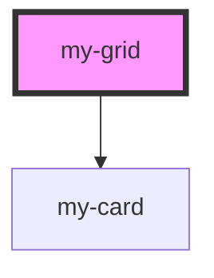

# my-grid

This component fetches and displays pictures from [Astronomy Picture of the Day](https://apod.nasa.gov/apod/astropix.html) provided by [NASA API](https://api.nasa.gov/).

In order to make it happen, you will need your API key generated in [NASA API portal](https://api.nasa.gov/).

Once you get your API key, create `.env` file and write your API key like the following.

```js
API_KEY=<YOUR_API_KEY>

// replace <YOUR_API_KEY> with your api key from NASA API portal.
```

<!-- Auto Generated Below -->

## Dependencies

### Depends on

- [my-card](../my-card)

### Graph



---

_Built with [StencilJS](https://stenciljs.com/)_
